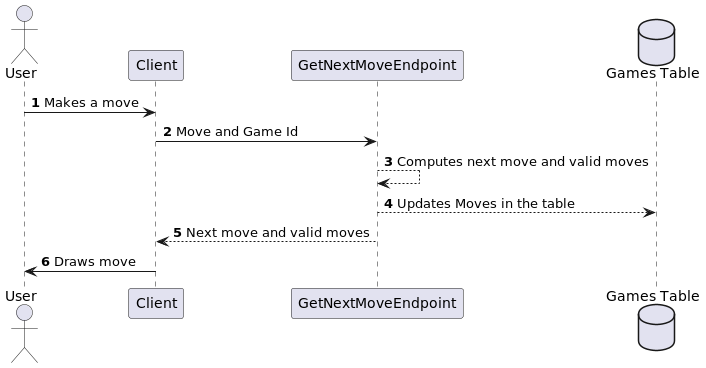
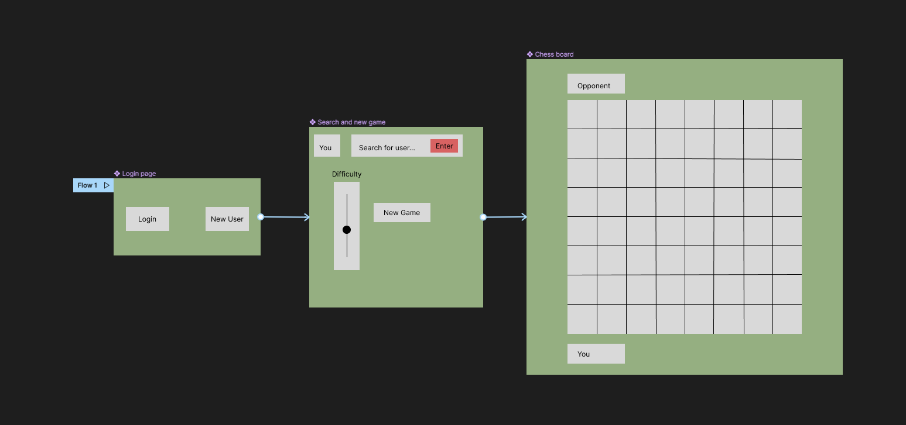

# The Chess Player Project

## 1. Problem Statement

This Chess Player full-stack project will allow multiple users with unique logins to play chess against a bot.

The Chess Player client will allow the user to set the difficulty of the competition, submit moves, and get real-time responses from a chess bot that can adapt to a specific difficulty level.

The user will be able to see which moves are valid when they select a piece to move, and will be notified when they are in check or if the game is over due to checkmate or stalemate.

Users will be able to view their game history on the client.

Users will also be assigned a rating based on wins or losses against specific difficulty bots (if you win against a "medium" opponent, you will gain a certain number of rating points, whereas winning against a harder opponent will net you more)

---
If I have extra time after completing the problem(s) above, I would like to explore implementing a live connection between 2 players

## 2. User Stories

1. As a user, I need to be able to send and receive chess moves from my opponent, so that I can play the game.
2. As a user, I need to be *unable* to make an invalid move, so that I don't break the rules. 
3. As a user, I need to know when the game is over (checkmate or stalemate), so I know if I won or lost (or drew). 
4. As a user, I would like to be able to set the difficulty of my opponent, or have the opponent be of similar rating to me, so that I can challenge myself.
5. As a user, I need to be able to log in and have my rating saved, so that I know how good I am.
6. As a user, I would like to receive email confirmation when I create my account, so that I have a record of it.
7. As a user, I would like to gain or lose rating based on wins and losses, so that I can have an accurate rating. The change in rating should be relative to the difficulty of my opponent.
8. As a user, I would like to be able to view my past games and replay them move by move, so that I can go over my games and look for mistakes. 
9. As a user, I would like to be able to resume my in-progress game if I lose internet or close my browser, so that I don't lose my progress.
10. As a user, I would like to be able to see which pieces my opponent and I have taken, so that I can keep track of who is winning.
11. As a user, I would like to be able to search for other users by username, so I can find my friends.

As mentioned in the problem statement, I want to implement a Player vs Player feature if I have enough time.

## 3. Plant UML

[Plant UML Class Diagram](./ChessCD.puml)

## 4. Dynamo DB tables

### Users Table
* Attributes:
  * username : String -> Partition Key
  * rating : Number
  * games : String Set
  * email : String
  * active : String
* Global Secondary Index: EmailSearch
  * email : String -> Partition key

### Games Table
* Attributes:
  * gameId : String -> Partition key
  * active : String
  * winner : String
  * whiteUserId : String
  * blackUserId : String
  * notation : String
  * validMoves : String
  * moves : String
  * botDifficulty : Number

## 5. API Endpoints

### CreateNewGameEndpoint
* Creates a new game with a unique gameId in the Games table, then returns the gameId
* POST
* /game
* Request Body: {authUserWhite: \<boolean>, otherUserId: \<otherUserId>, botDifficulty: \<botDifficulty>}
* Response: {gameId: \<gameId>}
* Might respond with an error if bot difficulty is out of bounds

### GetGameEndpoint
* Returns the game with the given id
* GET
* /game/{gameId}
* Response: {game: \<game object>}
* Might respond with an error if that game does not exist

### GetNextMoveEndpoint
* Uses stockfish to get the next move, and updates the game in the games table
* GET
* /move/{move}
* Takes in gameId as a query parameter
* Response: {move: move, game: \<game object>}
* Might respond with an error if gameId or move are invalid

### GetPublicUserEndpoint
* Gets a user from the Users table
* GET
* /users/public/{username}
* Response: {user: \<user object>}
* Might respond with an error if the user does not exist

### GetPrivateUserEndpoint
* Gets a user from the users table using an auth token
* GET
* /users
* Response: {user: \<user object>}
* Might respond with an error if the user does not exist

### CreateUserEndpoint
* Creates a user in the Users table using a cognito auth token
* POST
* /users/
* Response: {user: \<user object>}
* Might respond with an error if the email is invalid format, or if the userId is taken

### GetPreviousGamesEndpoint
* Returns a list of all previous games the user has played
* GET
* /getPreviousGames/{userId}
* Response: {gameIds: [gameId1, ...]}

### UpdateUserEndpoint
* Updates a user entry in the Users table, usually used to update rating (accepts '+value' or '-value' rating arguments)
* Will not overwrite fields in the table if arguments are left blank
* PUT
* /users/{userId}
* Request Body: {rating: \<rating>, username: \<username>, email: \<email>, active: \<active>}
* Response: {user: \<user object>}
* Might respond with an error if username or email are invalid Strings, if rating is invalid or reduced below 0, or if active is set to something other than true/false

## 6. Wireframe frontend

